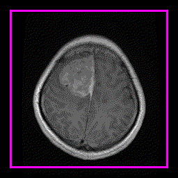

# Level Set Based Contour Evolution on Brain MRI Images
Python Implementation of Level Set Based Contour Evolution on Brain MRI Images. You can find the implementation in the [jupyter notebook file](Level_Set_Method.ipynb)

## Sample countour evolutions

  
   
   

## Define
- 

