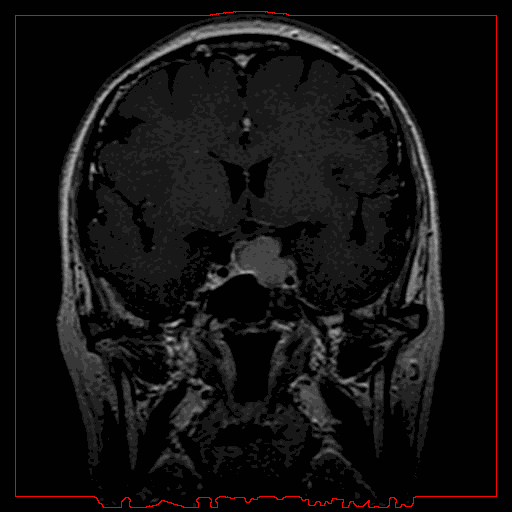
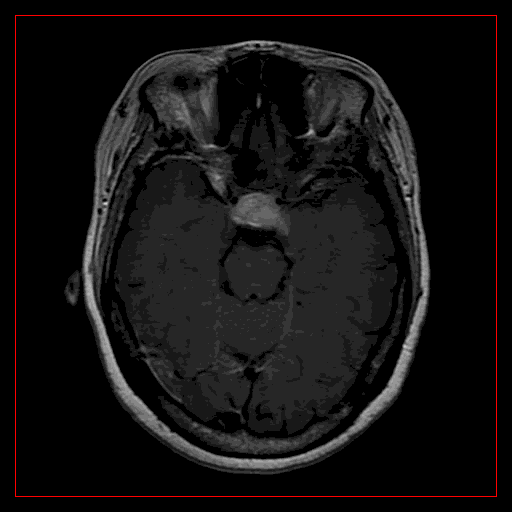
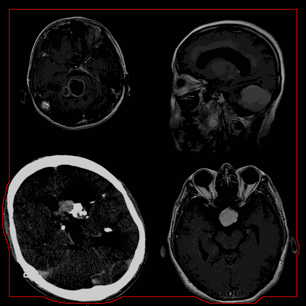
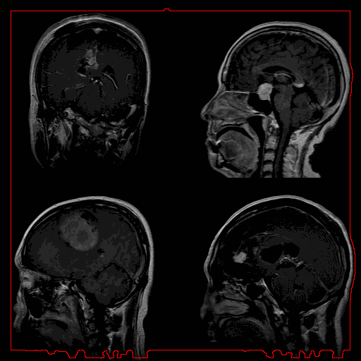

# Level Set Based Contour Evolution on Brain MRI Images
Python Implementation of Level Set Based Contour Evolution on Brain MRI Images

## Sample countour evolutions

  
  <!-- 
   
  --> 
   

## Define

